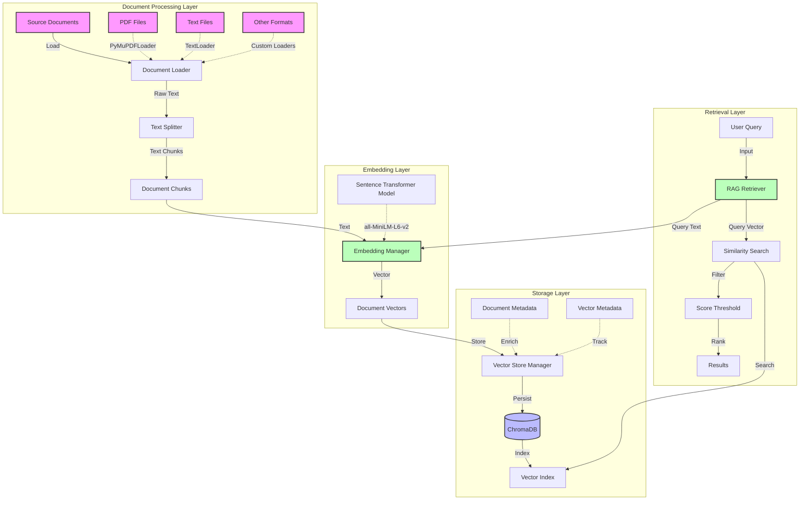

# RAG System Architecture



## Component Details

### Document Processing Layer
- **Document Loaders**: Multiple loaders for different file formats
  - PyMuPDFLoader: PDF processing
  - TextLoader: Plain text files
  - Extensible for other formats
- **Text Splitter**: RecursiveCharacterTextSplitter
  - Configurable chunk size (default: 1000)
  - Adjustable overlap (default: 200)
  - Maintains document coherence

### Embedding Layer
- **Embedding Manager**: Central embedding generation
  - Model: all-MiniLM-L6-v2
  - Dimension: 384
  - Batched processing
  - Progress tracking
- **Vector Generation**: Efficient text-to-vector conversion
  - Numpy array output
  - Shape validation
  - Error handling

### Storage Layer
- **Vector Store**: ChromaDB integration
  - Persistent storage
  - Collection management
  - Metadata tracking
  - Efficient indexing
- **Data Management**:
  - UUID-based document tracking
  - Rich metadata support
  - Content length tracking
  - Document indexing

### Retrieval Layer
- **RAG Retriever**: Core retrieval logic
  - Query processing
  - Vector similarity search
  - Score thresholding
  - Result ranking
- **Result Processing**:
  - Metadata enrichment
  - Distance calculation
  - Similarity scoring
  - Result formatting

## Data Flow

1. **Document Ingestion**:
   ```
   Source Documents → Document Loader → Text Chunks
   ```

2. **Embedding Processing**:
   ```
   Text Chunks → Embedding Manager → Document Vectors
   ```

3. **Storage Process**:
   ```
   Document Vectors + Metadata → Vector Store → ChromaDB
   ```

4. **Retrieval Flow**:
   ```
   Query → Embedding → Similarity Search → Filtered Results
   ```

## System Requirements
- Python 3.8+
- CUDA support (optional, for GPU acceleration)
- Sufficient storage for vector database
- RAM for embedding processing